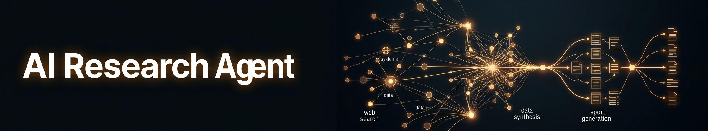
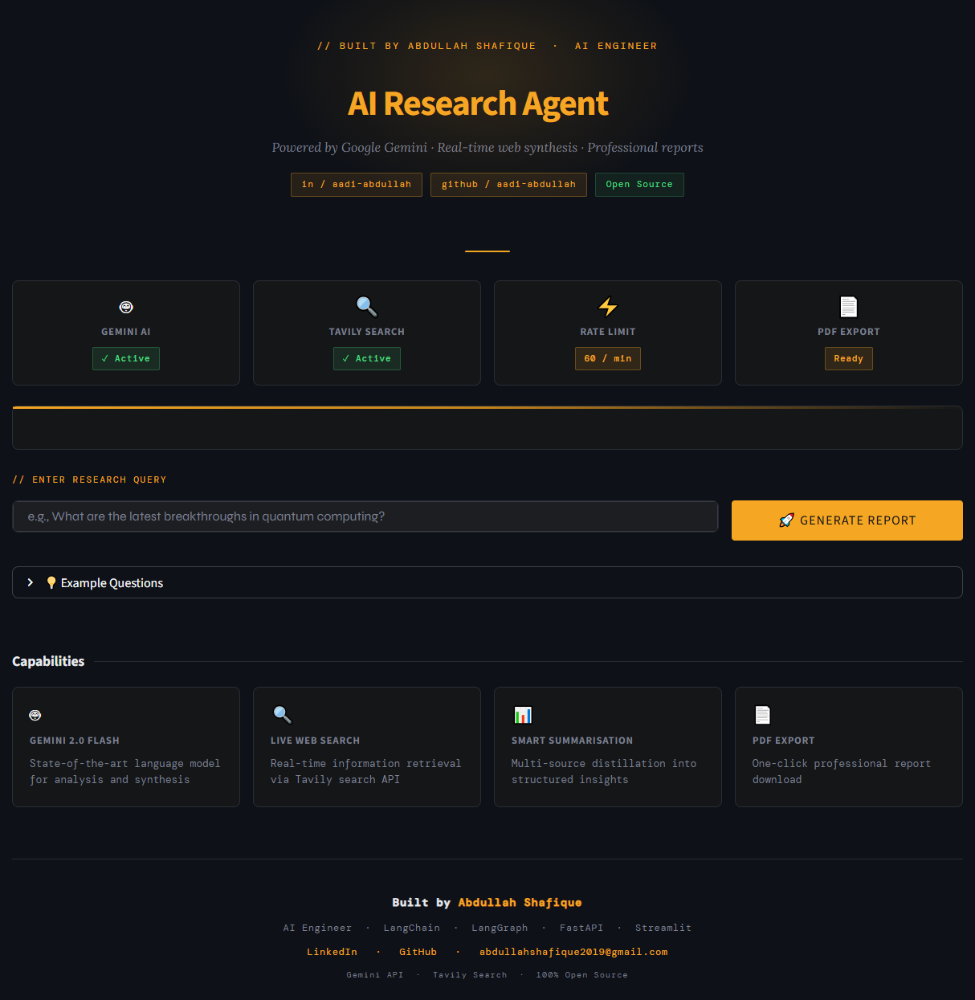
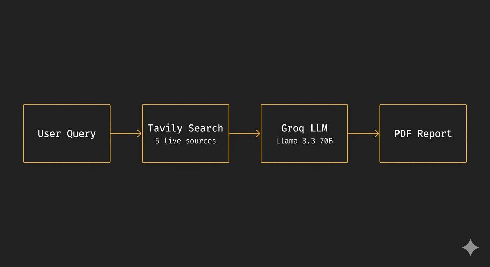

# 🧠 AI Research Agent

> Autonomous research agent that searches the web in real-time, synthesises multiple sources using LLMs, and generates structured, downloadable PDF reports — all from a single query.

**Built by [Abdullah Shafique](https://www.linkedin.com/in/aadi-abdullah)**  
AI Engineer · LangChain · Groq · Streamlit

[](https://aadi-research-agent.streamlit.app)
&nbsp;
[](https://github.com/aadi-abdullah)
&nbsp;
[](https://www.linkedin.com/in/aadi-abdullah)

---


<!-- Replace the demo placeholder with: -->


<!-- Add after the How It Works section: -->


## Overview

Most research tools give you links. This one gives you **answers**.

The AI Research Agent takes a research question, autonomously searches the web across multiple sources, uses an LLM to synthesise the findings, and produces a structured, professionally formatted report — ready to read or download as a PDF in under a minute.

No copy-pasting. No tab-switching. Just a question and a report.

---

## Demo


**Try it live →** [aadi-research-agent.streamlit.app](https://aadi-research-agent.streamlit.app)

---

## How It Works

```
User Query
    │
    ▼
[Search Agent]  ──  Tavily API searches 5 real-time web sources
    │
    ▼
[Summarizer]    ──  Groq (Llama 3.3 70B) distils all content
    │
    ▼
[Report Agent]  ──  Structures findings into a formatted report
    │
    ▼
[PDF Exporter]  ──  Generates a downloadable, branded PDF
```

---

## Features

- **Real-time web search** — Tavily API fetches live sources, not cached data
- **LLM-powered synthesis** — Groq's Llama 3.3 70B reads and summarises all sources together
- **Structured reports** — Organised with headings, sections, and a references page
- **PDF export** — Professional, branded PDF with author watermark on every page
- **Clean UI** — Dark editorial interface built with Streamlit

---

## Tech Stack

| Layer | Technology |
|---|---|
| UI | Streamlit |
| LLM | Groq — `llama-3.3-70b-versatile` |
| Orchestration | LangChain |
| Web Search | Tavily API |
| PDF Generation | fpdf2 |
| Language | Python 3.11 |

---

## Project Structure

```
ai-research-agent/
│
├── app.py                  # Streamlit frontend
├── config.py               # API key loader (.env / Streamlit secrets)
├── requirements.txt
│
├── agents/
│   ├── search_agent.py     # Tavily web search agent
│   └── report_agent.py     # LLM report generation
│
├── chains/
│   └── summarizer.py       # LangChain summarisation chain
│
└── utils/
    └── pdf_exporter.py     # Markdown → PDF renderer
```

---

## Local Setup

### Prerequisites
- Python 3.11+
- Free API keys from [Groq](https://console.groq.com), [Tavily](https://app.tavily.com), and [Google AI Studio](https://aistudio.google.com/apikey)

### Installation

```bash
# 1. Clone the repo
git clone https://github.com/aadi-abdullah/ai-research-agent.git
cd ai-research-agent

# 2. Create and activate virtual environment
python -m venv venv
venv\Scripts\activate        # Windows
source venv/bin/activate     # Mac / Linux

# 3. Install dependencies
pip install -r requirements.txt

# 4. Create .env file with your API keys
```

```env
# .env
GOOGLE_API_KEY=AIza...
TAVILY_API_KEY=tvly-...
GROQ_API_KEY=gsk_...
```

```bash
# 5. Run
streamlit run app.py
```

---

## Deploying Your Own Instance

This project is fully open source. To deploy your own version on Streamlit Cloud:

1. Fork this repository
2. Go to [share.streamlit.io](https://share.streamlit.io) and connect your fork
3. Set your API keys under **Advanced Settings → Secrets**:

```toml
GOOGLE_API_KEY = "AIza..."
TAVILY_API_KEY = "tvly-..."
GROQ_API_KEY   = "gsk_..."
```

4. Deploy — you'll get a public URL instantly

---

## Get Free API Keys

| Service | Free Tier | Link |
|---|---|---|
| Groq | Generous daily limits | [console.groq.com](https://console.groq.com) |
| Tavily | 1,000 searches / month | [app.tavily.com](https://app.tavily.com) |
| Google Gemini | 1,500 requests / day | [aistudio.google.com](https://aistudio.google.com/apikey) |

---

## About the Author

I'm an AI Engineer with a background in design — I spent 6 years as a professional graphic designer before transitioning into software engineering. That background shapes how I build: I optimise for systems that are both technically sound and genuinely usable.

- 🎓 Software Engineering — Riphah International University (GPA 3.99 / 4.0, 2024–2028)
- 🏅 AI Agent Developer Specialization — Vanderbilt University
- 🏅 Microsoft Python Development Specialization
- 🏅 Adobe Graphic Designer Specialization

**Currently open to AI engineering internships and junior roles.**

→ [LinkedIn](https://www.linkedin.com/in/aadi-abdullah) · [GitHub](https://github.com/aadi-abdullah) · abdullahshafique2019@gmail.com

---

## License

MIT — free to use, modify, and distribute.
